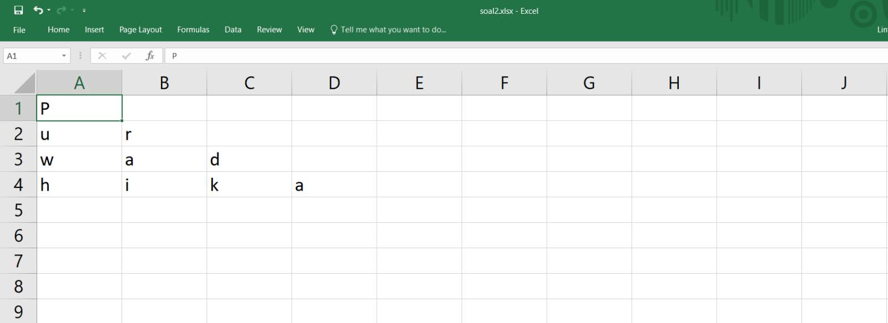
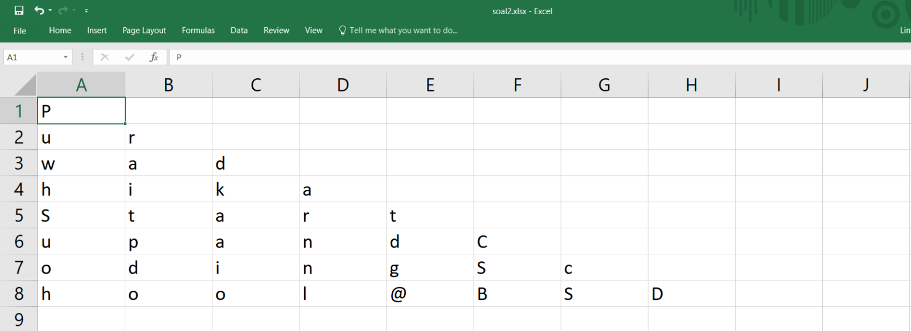
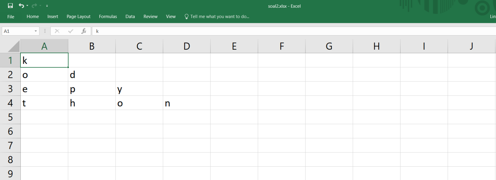

# Ujian_SegitigaExcel
### **Preview Soal 2 - Ujian Python Data Science Fundamental**

### **Soal 2 - 🔺 Segitiga Excel**

Buatlah __sebuah file python__ (*.py*) yang mengandung __sebuah function__ dengan __1 parameter__, yang dapat membentuk pola segitiga di sebuah __file Excel/Spreadsheet__ (*.xlsx*) dengan elemen berupa karakter-karakter dari sebuah __string__ yang menjadi parameter function tersebut. Info selengkapnya silakan ikuti case flow beserta output yang diharapkan berikut ini.

- __Case Flow__: Saat dieksekusi, program akan mencetak pola segitiga dari karakter-karakter string yang diinputkan, di sebuah file Excel. Jika jumlah karakter string memenuhi syarat terbentuknya pola, maka program akan menjalankannya. Namun jika jumlah karakter string tidak memenuhi syarat membentuk pola, maka akan muncul pesan bahwa string tidak memenuhi syarat membentuk pola.

    ```python
    segitigaExcel('Purwadhika')
    segitigaExcel('Purwadhika Startup and Coding School @BSD')
    segitigaExcel('kode')
    segitigaExcel('kode python')
    segitigaExcel('Lintang')
    ```

- __Output__ yang diharapkan:
    
    ```bash
    # segitigaExcel('Purwadhika')
    ```
    

    <hr>

    ```bash
    # segitigaExcel('Purwadhika Startup and Coding School @BSD')
    ```
    

    <hr>
    
    ```bash
    # segitigaExcel('kode')
    Mohon maaf, jumlah karakter tidak memenuhi syarat membentuk pola.
    ```

    <hr>

    ```bash
    # segitigaExcel('kode python')
    ```
    
    
    ```bash
    # segitigaExcel('Lintang')
    Mohon maaf, jumlah karakter tidak memenuhi syarat membentuk pola.
    ```
    
   
### *__#HappyCoding__* :relaxed:

*__Soal Ujian ini dibuat oleh:__* 
#### Lintang Wisesa :love_letter: _lintangwisesa@ymail.com_

[Facebook](https://www.facebook.com/lintangbagus) | 
[Twitter](https://twitter.com/Lintang_Wisesa) |
[LinkedIn](https://www.linkedin.com/in/lintangwisesa/) |
[Youtube](https://www.youtube.com/user/lintangbagus) | 
:octocat: [GitHub](https://github.com/LintangWisesa) |
[Hackster](https://www.hackster.io/lintangwisesa)
